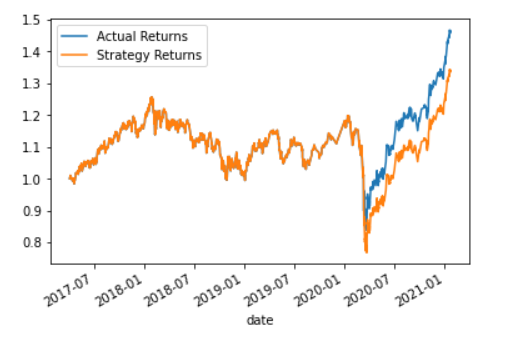
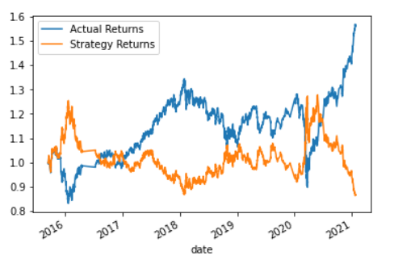
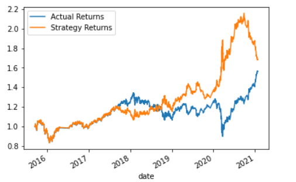

# Module_14
Algorithmic Trading

## First Model
Here we see the baseline classification report and graph for the SVC instance with SMA windows of 4 and 100, and training data of 3 months.

                  precision    recall  f1-score   support

         -1.0       0.43         0.04      0.07      1804
          1.0       0.56         0.96      0.71      2288

        accuracy                           0.55      4092
       macro avg       0.49      0.50      0.39      4092
    weighted avg       0.50      0.55      0.43      4092

This first attempt seemed to improve drastically on the baseline strategy, and even managed to slightly outperform the actual returns.

## Second Model - 24 month Training Period

                  precision    recall  f1-score   support

            -1.0       0.80      0.00      0.01      1229
             1.0       0.56      1.00      0.72      1565

        accuracy                           0.56      2794
       macro avg       0.68      0.50      0.36      2794
    weighted avg       0.67      0.56      0.41      2794
    

This model had problems finding any sell signals, so it basically mirrored the actual returns with a slight lag responding to the 2020 crash.

## Third Model - Lengthening the Long SMA window to 200 days

                  precision    recall  f1-score   support

            -1.0       0.45      0.45      0.45      1740
             1.0       0.57      0.57      0.57      2227

        accuracy                           0.52      3967
       macro avg       0.51      0.51      0.51      3967
    weighted avg       0.52      0.52      0.52      3967

This model found many more sell signals, but the actual strategy returns were much lower than the actual returns.

## Fourth Model - Logistical Regression with a Long SMA of 200 Days

                  precision    recall  f1-score   support

            -1.0       0.45      0.45      0.45      1740
             1.0       0.57      0.57      0.57      2227

        accuracy                           0.52      3967
       macro avg       0.51      0.51      0.51      3967
    weighted avg       0.52      0.52      0.52      3967
    

This model likewise found plenty of sell signals, and it capitalized on that by outperforming the actual returns in the second half of the data set. It performed especially well during the 2020 crash, but gave up a lot of gains right at the end of the data set, though it still outperformed the actual returns.