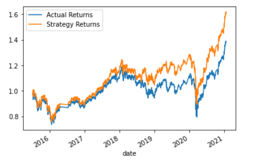

# Module_14
Algorithmic Trading

Here we see the baseline classification report and graph for the SVC instance with SMA windows of 4 and 100, and training data of 3 months.
              precision    recall  f1-score   support

        -1.0       0.43      0.04      0.07      1804
         1.0       0.56      0.96      0.71      2288

    accuracy                           0.55      4092
   macro avg       0.49      0.50      0.39      4092
weighted avg       0.50      0.55      0.43      4092

